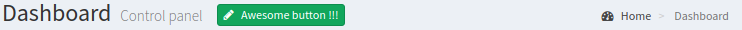

# Netlte > Panel

## Install

```
composer require netlte/panel
```

## Tests

Check code quality and run tests
```
composer build
```

or separately

```
composer cs
composer analyse
composer tests
```

## Usage

### Template
Default templates supports `Nette\Localization\Translator` for translating captions and can be overridden for global scope by changing static template path in `\Netlte\Panel\<COMPONENT_NAME>::$DEFAULT_TEMPLATE` or dynamically in runtime by
```php
/** @var \Netlte\UI\AbstractControl $control */
$control->setTemplateFile('/path/to/yours/template.latte');
```

### Header
`Netlte\Panel\Header` is GUI component created inside panel, where you can define page Heading, Subheading, ActionBar and BreadCrumbs navigation. 

#### Properties
* **heading** - Text describing action
* **subheading** - Icon describing action
* **actionbar** - [`Netlte\ActionBar\ActionBar`](https://github.com/Netlte/ActionBar)
* **bread** - [`Netlte\BreadCrumbs\Bread`](https://github.com/Netlte/BreadCrumbs/)

#### Example
```php
<?php

/** @var \Netlte\Panel\AbstractPanel $panel */
$panel;

$panel->getHeader()->setHeading('Dashboard');
$panel->getHeader()->setSubheading('Control panel');
$panel->getHeader()->getActionBar()->addButton('button', 'Awesome button !!!', 'pencil', null, null, 'success');

$panel->getHeader()->getBread()->setIcon('dashboard');
$panel->getHeader()->getBread()->addBreadCrumb('Home', 'this');
$panel->getHeader()->getBread()->addBreadCrumb('Dashboard', 'this');

```


### Panel
Idea of this panel is to wrap all content components into one big component which runs as nette servis. So your system modules, can reach any page component or add own component into panel no matter if page is actually requested.

Because panel have `startup()` method and `onInitialize` event, no component is loaded before it has to.

Panel is initialized only when are called `addComponent()`, `getComponent()`, `createComponent()` or `render()` methods. So all inner components are lazy loaded even all panels running on all requests.

#### Example
You have detail page of user which have tons of components as forms, graphs etc in you core application.
So you want to write SMS module but no as part of core. Sure you can, but after registering your sms module to the application you have to go and edit user detail page template to add form for send sms to user.
Then you have to go and edit presenter(which is part of app core) and inject form component. And ofcourse in future undo this change if you will want to remove sms module. 
No so nice true?

OR you can
* Used this panel to define user detail page by all core components.
* Register panel as service.
* Write form injector to your sms module and register it as servise too.
* Your injector add listener to `UserDetailPanel::onInitialize` and this listener will inject sms form into panel
* Panel have default template which render all defined components without need to edit it.
* When User detail page is requested panel automatically create all own components a render it with your sms form.

```php
<?php

/**
* Class UserDetailPanel running on every request as DI service
 */
class UserDetailPanel extends \Netlte\Panel\AbstractPanel {
    
    protected function startup() : void{
        // $this->addComponent(new SomeControl(), 'some_control')
        // ... just add core components
    }

}

/**
 * Class SmsFormInjector running on every request as DI service
 */
class SmsFormInjector {

    public function __construct(UserDetailPanel $panel) {
        $panel->onInitialize[] = function(UserDetailPanel $panel): void {
            $form = new Form();
            $form->addTextArea('message', 'Message');
            $form->addSubmit('submit', 'Send SMS');
            $form->onSubmit[] = function() {
                // send sms message
            };
            
            $panel->addComponent($form, 'send_sms_form', 'old_database_message_form');
            $panel->hideComponent('old_database_message_form'); // Not removed only not rendered
        };
    }
}

/**
 * Standard Nette presenter
 */
class UserPresenter extends \Nette\Application\UI\Presenter {

    /** @inject */
    public UserDetailPanel $detailPanel;
    
    /** @var \Netlte\Panel\AbstractPanel */
    private $panel;
    
    public function actionDetail(): void {
        $this->panel = $this->detailPanel;
        
        // do some stuff ...
        
        $this->setView('default'); // set default view for rendering
    }
    
    protected function createComponentPanel() {
        return $this->panel;
    }

}
```
template/User/default.latte - can be used for all presenter actions
```latte
{block content}
    {control panel}
{/block}
```

Panel extends `Netlte\UI\AbstractControl` so if need to keep some core component in panel but don't want to render it (for example to handling component's signals) your sms-module injector can use `$panel->hideComponent()` method. 

## Development

More examples are in [tests](../tests/) or in [sandbox](https://github.com/Netlte/Sandbox) project app.
